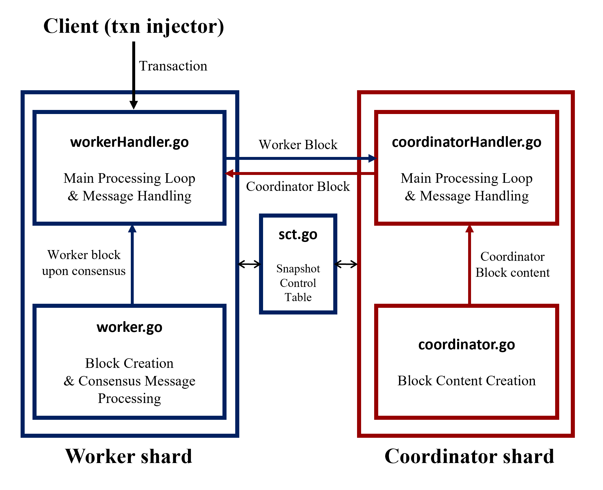

This document provides an overall explanation of the code-level implementation for understanding the core logic of Unishard. It also includes instructions on how to build and run Unishard on a local machine.

# Brief Protocol Description

Unishard uses two types of shards: a coordinator that orchestrates cross-shard transactions and workers that execute and commit transactions locally. Each shard maintains its own blockchain by running an independent BFT consensus algorithm. Unishard processes cross-shard transactions in two phases: coordinate and execute. In contrast, local transactions are processed only in the execute phase, bypassing the coordinate phase.

(1) Coordinate phase: When workers receive transaction requests from clients, they forward cross-shard transactions to the coordinator along with a selective local snapshot—a subset of local state variables required for executing those transactions. The coordinator then creates a global coordination sequence that specifies the serial order for these transactions and selectively integrates the local snapshots into a global snapshot. This sequence and snapshot are then disseminated to all workers.

(2) Execute phase: Upon receiving the global coordination sequence and snapshot, each worker identifies the cross-shard transactions to replicate and prepares a local execution sequence that specifies the order for both cross-shard and local transactions. The worker also replicates the relevant state variables for the replicated cross-shard transactions and initializes them using the global snapshot. Workers then execute and commit the transactions following the local execution sequence.

# Implementation Overview

The Unishard implementation consists of five key components (files):
- workerHandler.go and coordinatorHandler.go contain the main processing loops and message handlers for the worker shards and the coordinator shard, respectively.
- worker.go and coordinator.go include the functions required for block creation.
- sct.go includes the Snapshot Control Table and provides procedures for managing snapshot entries.




The primary communication occurs through blocks or block content. 
- worker.go and coordinator.go exchange their blocks. 
- worker.go creates a worker block, performs consensus, and sends it to workerHandler.go. 
- coordinator.go creates coordinator block content and sends it to coordinatorHandler.go.

The major functions and processing flow in each file are as follows.

## worker/workerHandler.go
- Start(): The worker’s block proposer starts the main processing loop. It generates a block every 0.25 seconds or when the number of transactions reaches 1,000.
- handleTransaction(): Upon receiving a transaction request from a client, add the received transaction to the mempool while collecting cross-shard transactions separately.
- handleCoordinationBlock(): Upon receiving a coordinator block from the coordinator shard, process the received coordinator block.
- StartWorkerConsensus(): Creates a worker block and initiates BFT consensus among other worker nodes.
- handleWorkerBlock(): When an agreed-upon block is received, append the block to the blockchain by assigning the block height value.

## worker/worker.go
- ProposeWorkerBlock(): Generate a worker block and performs BFT consensus by proposing it to all other nodes. The worker block contains the outcomes of both coordinate and execute phases.
- UpdateSCT(): Update SCT based on the received global coordination sequence (for the execute phase).
- GenerateLocalExecutionSequence(): Create a local execution sequence (for the execute phase).
- ReplicateExternalStateVariable(): Replicate external state variables and contracts (for the execute phase).
- ExecuteWorkerBlock(): Execute local execution sequence (for the execute phase).
- CreateLocalSnapshot(): Create local snapshot and local contract bundle (for the coordinate phase).
- CreateWorkerBlock(): Build a worker block.
- ProposeWorkerBlock(): Start BFT consensus.

## coordinator/coordinatorHandler.go
- Start(): The coordinator’s block proposer initiates the main processing loop. 
    - It generates a block every 0.25 seconds and initiates BFT consensus by proposing the block to other nodes. 
    - It contains a message handling loop that processes various types of messages, among which the worker blocks are particularly important. Upon receiving a worker block, it first verifies the safety of the local snapshot within the received worker block. If the snapshot is safe, it adds it to the SCT. It then stores the cross-shard transactions and contract code contained in the received worker block.


## coordinator/coordinator.go
- ProposeCoordinatorBlock(): Generate a coordinator block and performs BFT consensus by proposing it to all other nodes. 
    - Create a global coordination sequence and global snapshot.
    - Update the snapshot control table
    - Create a global contract bundle.
    - Create coordinator block content using the global coordination sequence, global snapshot, and global contract bundle. 


# How to Build and Run Unishard

While the experiments in the paper were conducted using AWS to operate geo-distributed nodes, this document explains how to perform experiments on a local machine.

## Recommended Specification

- OS: Ubuntu 22.04
- CPU: 16 core 32 thread CPU
- RAM: 64 GB

## Build Unishard

1. [Install Go (version should be higher or equal to 1.23.1).](https://go.dev/doc/install)

2. Clone this repository.
```bash
$ git clone https://github.com/anonymous819/sigmod25_unishard_artifact/

$ cd sigmod25_unishard_artifact
```

3. Build Unishard node and client program.
```bash
$ cd bin

$ go build ../main
```
4. Download stateDB for experiment.
```bash
$ wget http://1.229.180.186/downloads/statedb.tar.gz

$ tar -zxvf statedb.tar.gz -C ../common
```

5. Adjust configuration by referencing the configuration settings that we used for experiment is located at ../test directory.
```bash
$ cp ../test/per_shard_throughput_with_varying_percentages_of_CTs/cross_tx_30.json ../common/config.json
```


## Run Experiment

1. Run experiment.
```bash
$ ./simulation.sh
```

2. Watch main.*.gateway.log until "finished sending transaction" is shown.
```
...

...

[GDEBUG] 2024/10/23 20:43:39.024980 gateway.go:298: 97000 transactions sent

[GDEBUG] 2024/10/23 20:43:40.136237 gateway.go:298: 98000 transactions sent

[GDEBUG] 2024/10/23 20:43:41.282359 gateway.go:298: 99000 transactions sent

[GDEBUG] 2024/10/23 20:43:42.409870 gateway.go:298: 100000 transactions sent

[GDEBUG] 2024/10/23 20:43:42.409964 gateway.go:351: finished sending 100000 transactions
```
3. Check results on main.*.experimentResult.csv.
```csv
SystemTPS,TotalTPS,LocalTPS,CrossTPS,LocalLatency,CrossLatency,ConsensusForISC,ISC,ConsensusForCommit,WaitingTime,LocalConsensusForCommit,LocalWaitingTime

2370.000,395.000,368.500,26.500,2.678,32.311,0.776,0.221,0.225,30.936,0.206,2.472

2370.000,395.000,368.500,26.500,2.678,32.311,0.776,0.221,0.225,30.940,0.206,2.472
```

4. Stop experiment.
```bash
$ ./stop.sh
```


## Pre-configured Environment

We have configured a ready-to-execute environment. You can connect to our server and run the experiment as follows.

1. Use SSH to connect to the server (password: sigmod).
```bash
$ ssh sigmod@1.229.180.186 

$ cd bin
```
2. Adjust the configuration by referencing the configuration settings we used for the experiment, which are located in the ../test directory.
```bash
$ cp ../test/per_shard_throughput_with_varying_percentages_of_CTs/cross_tx_30.json ../common/config.json
```
3. [Run Experiment](#run-experiment)